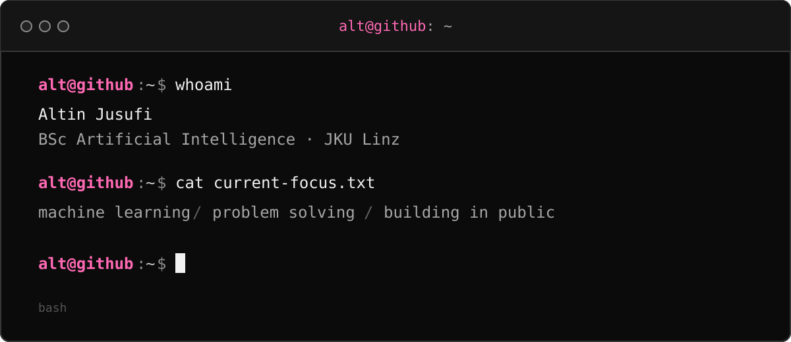
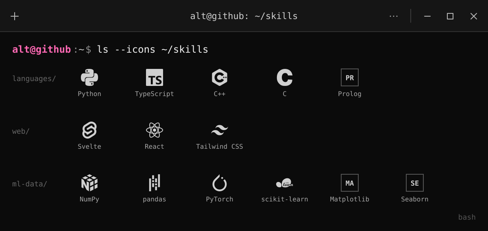
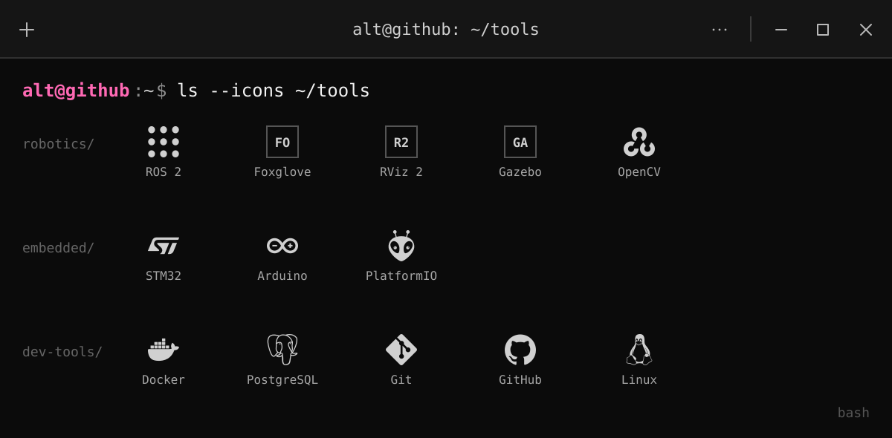

<p align="center">
  
</p>

<p align="center">
  
</p>

<!-- ABOUT -->
<p align="center">
  
</p>

<!-- DEEP-ML -->
<p align="center">
  <a href="https://github.com/ajusufi/deep-ml">
    
  </a>
</p>

<!-- SKILLS -->
<p align="center">
  
</p>

<!-- TOOLS -->
<p align="center">
  
</p>

<!-- ACADEMIC -->
<p align="center">
  
</p>

<details>
  <summary><code>alt@github:~$ tree ~/academic/completed</code></summary>

```text
completed/
└── course mapping pending
```

</details>

<details>
  <summary><code>alt@github:~$ tree ~/academic/currently-learning</code></summary>

```text
currently-learning/
└── course mapping pending
```

</details>

<details>
  <summary><code>alt@github:~$ tree ~/academic/up-next</code></summary>

```text
up-next/
└── course mapping pending
```

</details>

<br />

<!-- HOBBIES -->
<p align="center">
  
</p>

<!-- CONTRIBUTIONS -->
<p align="center">
  
</p>
